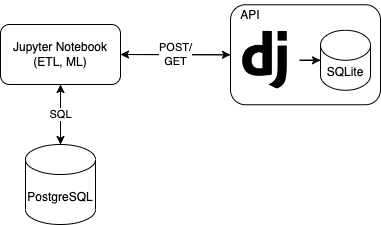

# Stock Market Data Pipeline

# Data Pipeline
## Environment
1. Python 3.7.16
2. pip 19.0.3
3. Jupyter Notebook
   1. IPython: 7.34.0 
   2. jupyter_client: 7.4.9 
   3. jupyter_core: 4.12.0
4. PostgreSQL 14.3

## Steps
1. install dependencies in your Jupyter Notebook env.
   1. `pip install -r stock-market/requirements.txt`
2. install Postgres locally
   1. I am using Docker version https://hub.docker.com/_/postgres
3. `stock-market/tables.sql`
   1. contains 1 table definition.
   2. execute this script against the Postgres instance.
4. `stock-market/Data Pipeline.ipynb`
   1. the main Jupyter Notebook containing data pipeline steps.
   2. open this file in your Jupyter Notebook and run the steps one by one.
5. `stock-market/AAPL_historical_data.csv`
   1. this is sample downloaded data from Yahoo Finance.

# API (Optional)
It is optional to install API on your local machine 
since it is also deployed to my personal AWS (IP 54.80.105.153) to simplify 
testing of the data pipeline from anywhere.

##Endpoints
1. `POST http://54.80.105.153:8000/api/stock-data`
   1. this endpoint will insert new historical stock data.
   2. `payload`: historical stock data in `JSON`. 
2. `GET http://54.80.105.153:8000/api/stock-data`
   1. this endpoint will retrieve historical stock data.
   2. `param`: start_date. e.g. `"2023-09-01"` (optional).
3. `POST http://54.80.105.153:8000/api/stock-data/reset`
   1. this endpoint will delete all raw stock data that have been uploaded to this api.
   2. `payload`: -

## Environment
1. Python 3.7.16 (or higher)
2. pip 19.0.3
3. venv

##Files
1. `stock-market/api/*`:
   all files related to API creation (using Django framework).
   
##Steps to install API locally
   1. install `python3`, `venv`, `pip`
   2. run `python3 -m venv stock-market_env`
   3. run `source stock-market_env/bin/activate`
   4. run `cd stock-market/api` then `pip install -r requirements.txt`
   5. run `python manage.py migrate`
   6. run `python manage.py runserver 0.0.0.0:8000`
   